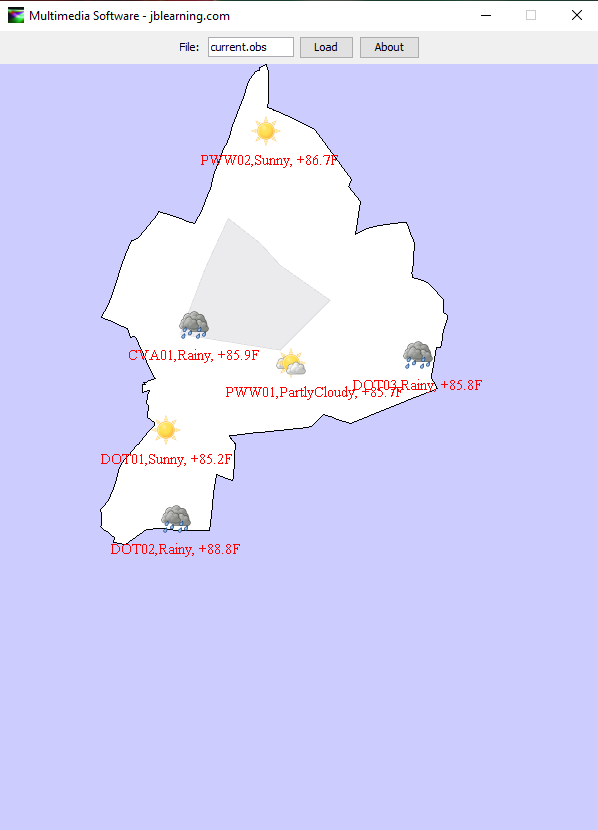

# WeatherBitMaps
A weather forcast and weather monitoring display program.

**steps to follow**

1) Clone this project to your IDE.
2) This project uses the Miltimedia API which if you do not have it, you can download it here: https://users.cs.jmu.edu/bernstdh/web/MultimediaSoftware/v2/multimedia2.jar
3) once you downloaded the API, build path from the project to the multimiadia API.
4) convert the project into an executable jar file
5) download the following files: https://w3.cs.jmu.edu/bernstdh/web/CS349/pa7/track-500.map, https://w3.cs.jmu.edu/bernstdh/web/CS349/pa7/track-1500.map, https://w3.cs.jmu.edu/bernstdh/web/CS349/pa7/track-4000.map *make sure that they have the .map extension and not .map.txt*
6) drop the above downloaded files into an the same folder as the .jar file you created in step 4.
7) download the following files: https://w3.cs.jmu.edu/bernstdh/Web/CS349/pa3/30August2021.for, https://w3.cs.jmu.edu/bernstdh/Web/CS349/pa3/current.obs
8) use and absolute path to the destination of the obove downloaded files or if you from them into the same folder as the jar file, just simply write the same of the file in the text are. For example: current.obs
9) Done! 

**Interaction design looks like the following:**

It reads a .for or .obs files and diplay its information to the map. The **absolute path** must be inserted in the text field.

It can take 2 commandline arguments. arg[0] is not null then the Weatherbits logo will show, if arg[1] is not null then the logo will be grayout. 

**.obs files format is the following:**
  location,  weather condition, temperature

.obs (observation) looks like the following:

  

**.for files format is the following:**
  location,  weather condition, low , high

files .for (forcast) looks like the following:

