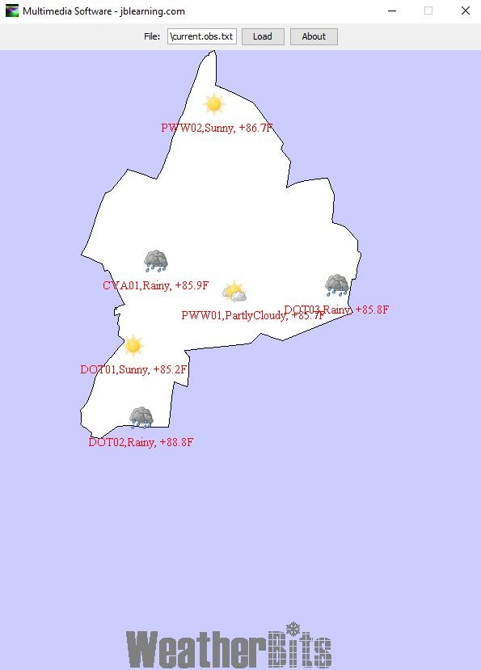
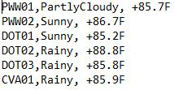
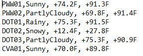

# WeatherBitMaps
A weather forcast and weather monitoring display program.

Interaction design looks like the following:

It reads a .for or .obs files and diplay its information to the map. The **absolute path** must be inserted in the text field.

It can take 2 commandline arguments. arg[0] is not null then the Weatherbits logo will show, if arg[1] is not null then the logo will be grayout. 

**.obs files format is the following:**
  location,  weather condition, temperature

.obs (observation) looks like the following:

  

**.for files format is the following:**
  location,  weather condition, low , high

files .for (forcast) looks like the following:

